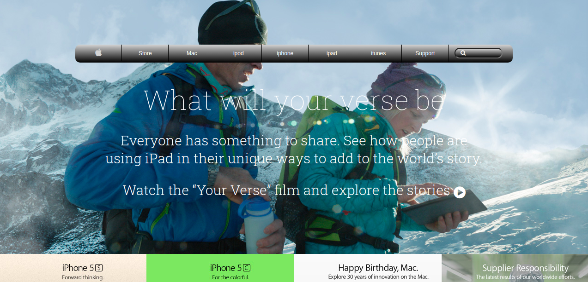

# Apple background and gradient

> It is a Apple site prototype for Apple website created for educational purposes.

## Built With

- HTML
- CSS
- Visual Studio Code

## Live Demo

[Live Demo Link](https://rawcdn.githack.com/imran5644/apple_backgrounds_and_gradients/d9c18cd5b67a35a32ab7199650844b3ff8315b78/index.html)

## Getting Started

To get a local copy up and running follow these simple example steps.

Grab the index.html file and open it in any tab of your preferred internet browser.

## Authors

👤 Imran Yousaf

- GitHub: [@imran5644](https://github.com/imran5644)
- LinkedIn: [Imran Yousaf](https://www.linkedin.com/in/imran-yousaf-8777297b/)

👤 Marcelo Araújo

- GitHub: [@marcelomaidden](https://github.com/marcelomaidden)
- Twitter: [@marcelomaidden](https://twitter.com/marcelomaidden)
- LinkedIn: [Marcelo Fernandes de Araújo](https://www.linkedin.com/in/marcelo-fernandes-de-ara%C3%BAjo-56700a171/)

## Show your support

Spread the word if you like this project.

## Acknowledgments

- Thanks to W3Schools
- Thanks to Stack Overflow
- Apple company
